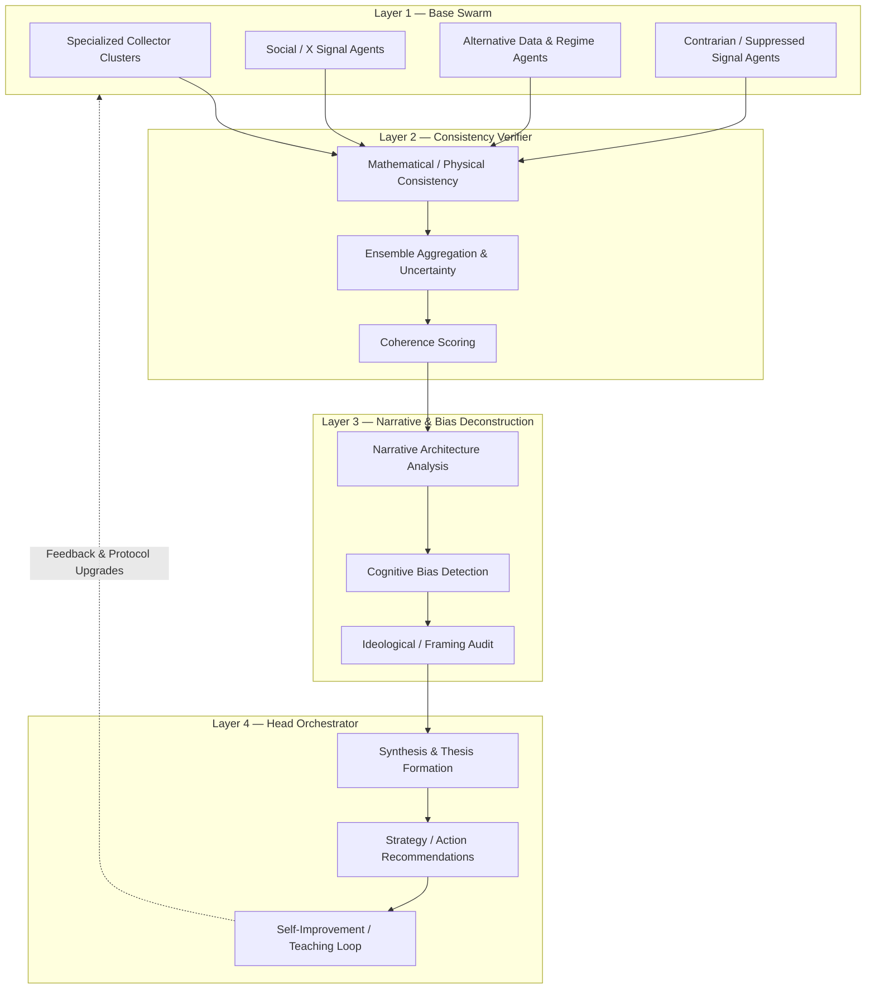

# System Architecture Overview

## Hierarchical Multi-Agent Stack

## Zero-Trust Handoff Flow

Every arrow above is a **verified handoff**. The receiving layer must:

1. Receive a complete structured package (payload + provenance + confidence + dissent log + source scoring)
2. Independently surface contradictions
3. Re-weight or re-score according to its specialized function
4. Propagate residual uncertainty upward
5. Never silently discard high-confidence minority views without documentation

Machine-readable contract: [`schemas/handoff.schema.json`](schemas/handoff.schema.json).

## Design Intent

Most multi-agent systems fail by collapsing too early into consensus or by treating every agent output as equally trustworthy. This architecture deliberately slows the process at each boundary in exchange for higher reliability under noisy, adversarial, and narrative-heavy information environments.

The same skeleton supports quantitative prediction, real-time open-source intelligence, technical research synthesis, and media analysis. Only the specialized clusters and verification models change.

## Runnable Modules

| Path | Role |
|------|------|
| `swarms/telemetry/` | Multi-agent public telemetry fusion + coupled anomaly detection |
| `agents/shadow/` | Recursive multi-turn analysis agent with learning state |
| `protocols/sesp/` | Gated self-evolution, hierarchical memory, discovery expansion |
| `extractors/echo/` | Document/page extraction helpers for collector layers |
| `pipelines/python/` | Quantitative ingestion and recursive learning loops |
| `tools/glass-x/` | Local X composition scoring and scheduling |

These implement the same verification and feedback principles described above.
